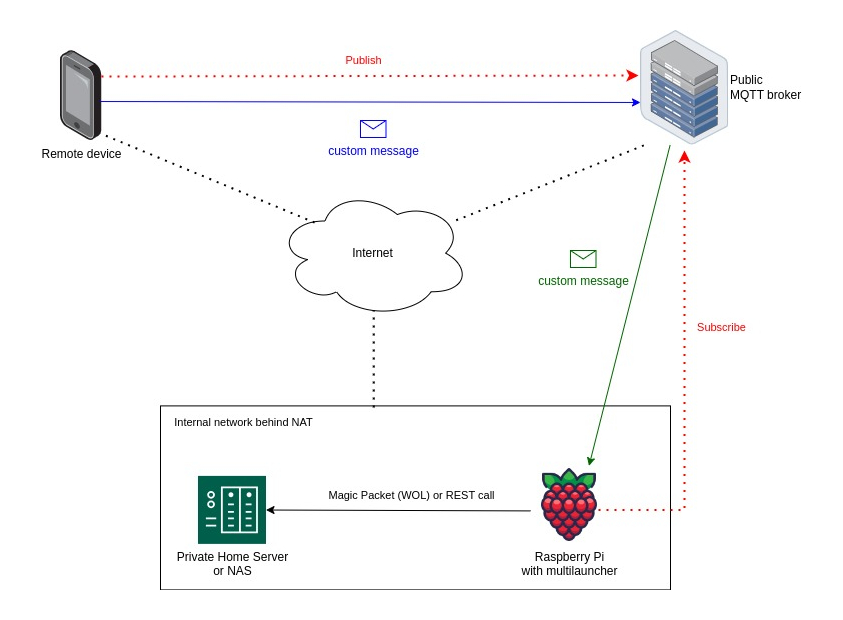

# Multilauncher: Remote Command Execution on your  Raspberry Pi (or Linux server)

This document provides a clear and informative overview of Multilauncher, a client-server application for remotely executing commands on your Raspberry Pi.

## What is Multilauncher?

Multilauncher allows you to run scripts or commands on your Raspberry Pi by sending custom messages to a message broker (MQTT or RabbitMQ) or a network server (TCP or UDP). This enables you to manage your devices remotely without needing a direct connection.

### Default Mode and Benefits:

By default, Multilauncher operates in MQTT mode, making it ideal for managing devices remotely. It utilizes an MQTT listener to receive specific messages on a designated topic. Upon receiving the message, it triggers the execution of a predefined command.

### Example Use Case:

Imagine connecting Multilauncher on your Raspberry Pi to a free public MQTT broker like HiveMQ. You can then send a specific message from another device (like a smartphone with [MQTT Dashboard for Android](https://play.google.com/store/apps/details?id=net.routix.mqttdash&hl=en-US)) to trigger an action on your home server (hidden behind a NAT firewall). This could include powering on the server, starting a container, or launching a virtual machine.

## Setup and Installation:

Multilauncher requires Python 3.9 and Bash to run and can be installed on Linux/Unix environments (including Windows under WSL). Its memory footprint is light, allowing it to function even on older Raspberry Pi models with limited RAM.

### Virtual Environment Setup (Recommended):

It's highly recommended to run Multilauncher within a Python virtual environment (VENV) for better isolation and dependency management. The instructions provide steps to install pyenv and switch to Python 3.9. It then guides you through creating and activating a virtual environment within the project directory.

### Configuration Files:

The config folder houses various configuration files:

- **common_conf.py**: Defines shared parameters like enabled listeners and message prefixes.
- **mqtt_conf.py**: Defines MQTT connection details like broker address, port, encryption, authentication, and topics (example provided for HiveMQ with encryption and authentication enabled).
- **rabbitmq_conf.py**: Defines RabbitMQ connection information like host and port.
- **tcp_conf.py**: Defines TCP server parameters like port and host.
- **udp_conf.py**: Defines UDP server configuration (port and host).

The document details how to configure mqtt_conf.py using HiveMQ settings, including creating an account and enabling TLS encryption and authentication.

### Custom Command Creation:

The launcher folders contain JSON files for defining custom commands. The provided example showcases the structure and details of each attribute:

    {
	    "name": "My-NAS",
	    "description": "Start/Stop NAS",
	    "start_message": "start nas",
	    "stop_message": "suspend nas",
	    "can_be_stopped": true,
	    "start_command": "etherwake -i wlan0 FF:FF:FF:FF:FF:FF",
	    "stop_command": "curl -k --user admin:password https://192.168.1.3/api/suspend",
	    "multiple_instances": false,
	    "enabled": true
	}

- **name**: Unique identifier for the service.
- **description**: Brief explanation of the command's purpose.
- **start_message**: The message received from the listener (preceded by a prefix) that triggers the start_command.
- **stop_message** (optional): The message (preceded by a prefix) that triggers the stop_command.
- **can_be_stopped**: Boolean indicating whether the service can be stopped using the stop_command.
- **start_command**: The command to launch the service (e.g., etherwake to power on a NAS).
- **stop_command**: The command to stop the service (e.g., a curl command to call a suspend API).
- **multiple_instances**: Boolean indicating if multiple service instances can run concurrently.
- **enabled**: Boolean indicating if the service is available for use.

### Installation as System Service (Debian-based):

For Debian-based systems like Raspbian and Ubuntu, the script setup/install-as-service.sh allows you to install Multilauncher as a system service. This utilizes the systemctl command and requires root privileges. Remember to activate the virtual environment before running the script.

### Uninstall:

Use the setup/uninstall.sh script (run as root) to remove Multilauncher from your system.

## License:

Multilauncher is released under the Apache2 License.
